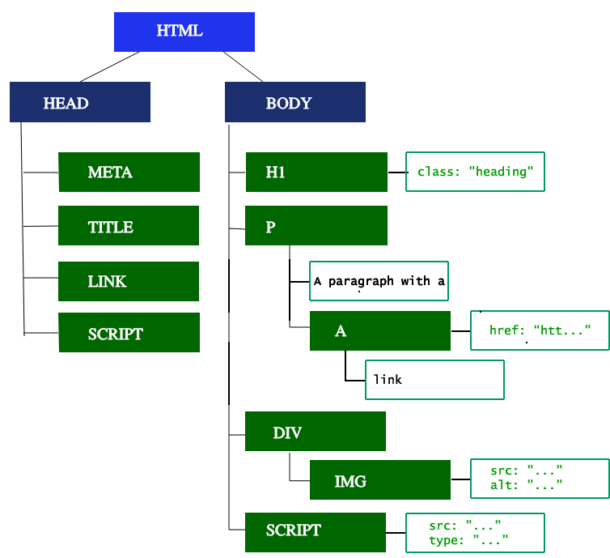

# Introduction to DOM

[tsevdos.me](https://tsevdos.me/) / [@tsevdos](https://twitter.com/tsevdos)

---

# Rules

Feel free to interrupt me for:

- questions
- relevant comments

---

# Agenda

- how the web works
- how browsers request a page from a server
- how browsers render a page
- what is the DOM

---

# How the web works

- the web is a network of computers all over the world
- it enables the sharing of information and resources
- key components: web browsers, web servers, and the internet

---

# Web browsers, servers, and internet

- **web browser (client)**: a software application for accessing information on the web. Examples: Chrome, Firefox, etc.
- **web server**: a computer system that hosts websites and delivers web pages to browsers. Examples: Apache, Nginx, etc.
- **internet**: a global network of interconnected computers using standardized communication protocols

---

# Communication protocols

- **HyperText Transfer Protocol**
- **HTTP/HTTPS**: protocols used for transferring web pages. HTTPS is the secure version
- **DNS (Domain Name System)**: translates human-readable domain names (like www.example.com) into IP addresses

---

# How browsers request a page from a server

- user enters a URL in the web browser
- browser resolves the URL to an IP address using DNS
- the browser sends an HTTP request to the server
- the server processes the request and sends back an HTTP response with the web page data
- the browser receives the data

---

# How browsers render pages

- the browser sends an **HTTP request (GET)** on behalf of the user
- it gets back a **response** (let's assume that it is an **HTML file**)
- it collects **all** the other resources needed to render the page
- the browser is **parsing** the data and builds the **DOM** and **CSSOM**
- by combining the **DOM** and **CSSOM** the browser starts to **render** the page
- the final **rendering** step is to **paint** the page to the user's screen
- everytime either the **DOM** (or **CSSOM**) changes the page re-renders

---

# What is the DOM (Document Object Model)?

- the DOM is an object-oriented representation of the web page, which can be modified with JavaScript
- the Document Object Model (DOM) treats an HTML (or XML) document as a tree structure where each node is an object representing a part of the document
- nodes can be elements, attributes, text, etc.
- it represents the page so that programs can change the document structure, style, and content

---

# The DOM tree

---

# HTML and the DOM

- HTML (HyperText Markup Language) is the standard language for creating web pages
- when a web page is loaded, the browser parses the HTML and generates the DOM
- the HTML elements become the nodes of the DOM tree

---

# JavaScript and the DOM

- JavaScript is a scripting language that can manipulate the DOM
- through JavaScript, you can add, remove, and modify elements and content on the web page dynamically
- JavaScript interacts with the DOM using various methods and properties (web APIs)

---

# Workshop

- demo

---

# Happy coding!
